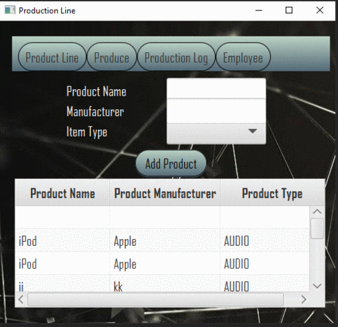
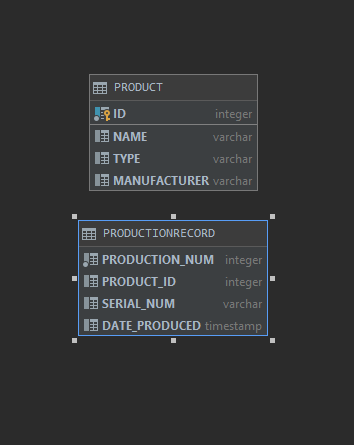
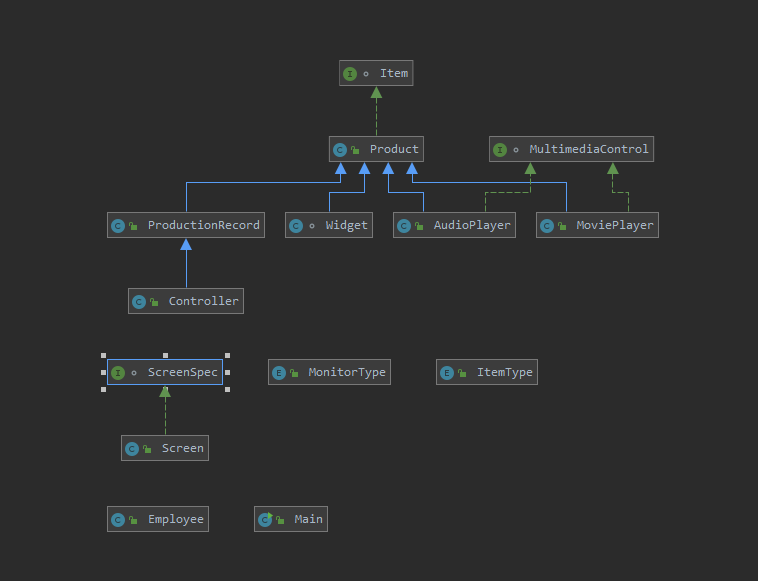

# ProductLine Revision for Design Patterns and Refactoring Class

This is a production tracker program intended for use by a factory that produces media players. At the time of writing, I am a Junior in college at Florida Gulf Coast University. This program is specifically for an Object Oriented Programming assignment, and is a semester long project that will continue to receive updates as time goes on.

## Demonstration

## Documentation
https://nickw6499.github.io/ProductLine/

## Diagrams

## Getting Started
To get this program started on your computer, follow the steps below:
Download the IDE of your choice capable of creating and running a JavaFX project. This IDE must be able to use databases. Clone this repository, then open the project in your IDE. Establish the database on your computer and direct it with the file path to the res folder you initially cloned. After this the program should run.

## Built With
IntelliJ Idea Ultimate, 
Scene Builder, 
Discord group discussions

## Author
Nicholis Wright

## Acknowledgments
Stack Overflow, 
Odalys Martinez, 
Kevin Mak, 
Professor Scott Vanselow

## History
9/10/2019 This project started out as a GUI with no data base attached or CSS. 
9/28/2019 The project now has a CSS file to style the GUI and a data base attached.
11/9/2019 The project now has integreated table views and database functionality to record progress.
12/4/2019 The project has custom serial numbers and populates tables from the database.

## Key Programming Concepts Utilized
Key concepts I used in this project are establishing databases with H2, creating a file path for said data base, inserting items into the database using SQL and CSS to create a design for the GUI.
